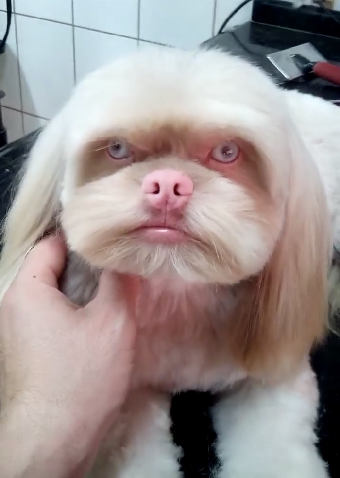

Добавление картинки в текст 

Заменил текст на вторую картинку 

Чтобы выделить текст полужирным необходимо обрамить его двойными звёздочками (**) или двойным знаком подчёркивания. Например **Вот так** или __вот так__.
